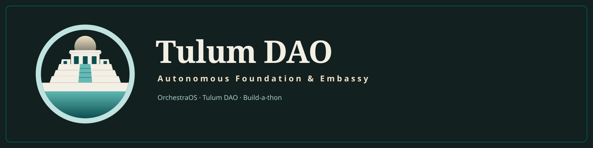

# OrchestraOS

OrchestraOS, published by Tulum DAO: an open harness for running a fleet of coding agents as a team — agents that message each other, remember across restarts, rotate themselves before they run out of context, and put every real decision in front of the human on their phone.

**This is not a finished product.** It runs one operator's fleet today, every day, and that setup is the reference install. We are opening it so people who want this to exist can build it with us. The first hackathon — Build-a-thon — is Saturday and Sunday, 2026-09-19 and 20.

## What is in the box

- **Seats and generations.** An agent is a seat with a lineage. Each generation is one CLI session (Claude Code, Gemini CLI, or Codex). When a generation nears its context ceiling it writes a handoff, a successor boots, proves it understood the handoff by answering questions anchored in the predecessor's own state, and is promoted. Rotation is autonomous and on by default for Claude seats; Gemini and Codex are experimental and are not armed unless you set `[rotation] experimental_runtimes = ["gemini", "codex"]`.
- **Inter-agent messaging.** A durable message store with inboxes, acks, threads, and a router that parks mail for busy seats instead of losing it.
- **Memory.** A shared facts store with freshness, per-seat memory directories that survive rotation, and a recall hook that feeds the assistant.
- **Approvals surface.** Every decision an agent needs from the human is a card: approve or deny, a menu, a questionnaire, or a "waiting on you" block. Cards render on a web dashboard and an iOS and watch app, and the human's answer resumes the agent that asked.
- **Arturo.** The assistant. The main page, the new-chat page, and a button that is available on every other page and knows what you are looking at. Text today; voice through your own keys.
- **Runtime catalog.** Probes which CLIs are installed and authenticated and offers their models, so the harness runs on whatever subscription you already have.

**Before you start:** you need one agent CLI already installed and logged in — Claude Code, Gemini CLI, or Codex, your choice. See `docs/INSTALL.md` §0 for the exact commands, `docs/COSTS.md` for what each plan costs (including a no-cost option), and `docs/BEGINNERS_GUIDE.md` if this is your first time in a terminal at all.

## Two ways to run it

**Minimum path** (one machine, one CLI, no voice, no chat bridges): gateway up, one seat spawned, one card answered from the web dashboard. Target is under thirty minutes on a clean Ubuntu VPS. See `docs/INSTALL.md`.

**Reference install** (the operator's own setup): a VPS plus a Mac over Tailscale, tmux seats, the rotation beat, push notifications, Telegram, and voice. See `docs/REFERENCE_INSTALL.md`. Do this second.

## More docs

- `docs/BEGINNERS_GUIDE.md` — never used a terminal? Start here.
- `docs/GATE.md` — the seven-step gate everyone completes first: command, expected output, and what to check if it fails, for each step.
- `docs/PROMPTS.md` — copy-paste prompts for the same seven steps, plus the tracks.
- `docs/UPGRADE.md` — pulling latest `main` without losing a running seat.
- `docs/COSTS.md` — what a VPS and a CLI plan actually cost, and the zero-key path.
- `docs/tracks/README.md` — the twelve hackathon tracks, one doc each.
- `docs/ARCHITECTURE.md` — the map. Read before touching rotation or approvals.
- `docs/MEMORY.md` — per-seat memory (index + one-fact files + baton) and the facts store Arturo recalls from; the copy-paste prompt for gate step 7.

## Configuration

Copy `orchestra.example.toml` to `orchestra.toml` and fill in the data directory, hosts, ports, your operator id, and the runtimes you have. Secrets are never in the file: bot tokens and API keys are read from the environment only. `orchestra doctor` tells you what is missing.

## Hackathon tracks

Twelve tracks, each with its own doc: Problem, Design, files to touch, numbered
steps, an acceptance test, and a start prompt you can paste straight into your own
agent. See `docs/tracks/README.md` for the full index. The big ones:

1. Device pairing, so the phone app logs in by scanning a code instead of a token baked into the build.
2. Zero-key assistant brain on your own CLI runtime.
3. On-device speech for a voice tier with no vendor keys.
4. Arturo home and conversation-first onboarding, from the reference mockups in `design/`.
5. First run without a general manager seat.
6. Chat bridges as plugins.
7. Tab restyle to the reference set.
8. Push without ntfy.
9. Installer and doctor hardening.
10. Docs and tutorials.
11. Autonomous rotation proven on all three runtimes on a clean install.
12. Gauntlet mode: a critic loop that scores creative work against real references before it reaches you.

`good-first-issue` is real and small (see `docs/HACKATHON_ISSUES.md`). Start there
if you want to land something in an hour. New to the command line entirely? Start
with `docs/BEGINNERS_GUIDE.md` instead — it walks the seven-step gate everyone
completes before picking a track.

## How to contribute

Repo: https://github.com/Tulum-DAO/orchestraos (private until the Saturday
hackathon opens; public from then on). Fork, branch, open a pull request
against `main`. CI runs the tests per package and a secrets scan, and both must pass. Sign off your commits (DCO). Read `CONTRIBUTING.md` for the review rules and `ARCHITECTURE.md` for the map before you touch the rotation lane or the approvals contract, which other components depend on.

Maintainers answer pull requests within the hour during the hackathon weekend.

## License

Apache 2.0. See `LICENSE`.
