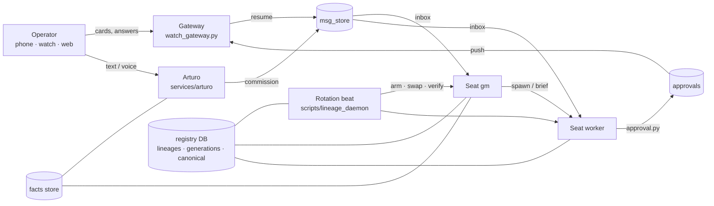

# OrchestraOS architecture

One page, the map. Read this before touching the rotation lane, the approvals contract, or the message store, because other components depend on their shapes.

## Vocabulary

- **Seat.** A named agent with a lineage (`gm`, `orchestra-builder`, `pm-acme`). A seat is a tmux session running one CLI runtime.
- **Generation.** One session of a seat. Generation 12 of `gm` is a specific Claude Code session id. The registry DB holds every generation with its runtime, model, session id, and resume command.
- **Canonical.** The pointer from a seat to its live generation. Exactly one generation is canonical per seat. Everything that talks to a seat resolves it through this pointer, never through a tmux name.
- **Baton / handoff.** The document a generation writes before it retires: state by effect, landmines, last commit, and five canary questions whose answers live only in the predecessor's own state.
- **Readback.** The successor's written answers to the canary. A grader keys sections by question id and checks anchors against the predecessor's transcript. Promotion needs a pass.
- **Card.** A decision surfaced to the operator: approval, menu, questionnaire, human task, commitment. Cards never expire.

## Components

### Message store (`msg_store.py`, `message_bus.py`, `protocol.py`)
SQLite-backed inboxes. `send` writes a row; the receiver reads with `inbox` and closes with `ack`. Replies thread on `parent_id`. Bodies go through `--body-file`, never inline, because shells mangle them. The store does not wake an idle agent; the router does that.

### Router (`scripts/message-router.py`)
Runs on a schedule. For each undelivered row it probes the target pane: idle means inject and mark submitted, busy means park. Parked rows are retried, never dead-lettered. One notice per stuck target per episode, so a busy seat does not spam its senders.

### Spawn and registry (`spawn-agent.sh`, `scripts/identity_store/`)
`spawn-agent.sh <seat> --task ...` creates the tmux session, launches the runtime, registers the generation in the DB, and projects the flat `registry.json` from it. The DB is the truth, the JSON is a projection. `identity_writer` is the single writer; `identity_reconciler` repairs drift from the transcript side and is optional in the schedule.

### Approvals (`scripts/approval*.py`, gateway, dashboard, iOS)
`approval.py request --from <seat>` is the only way to make a card. It validates, inserts, and pushes. The author is the seat that needs the answer; the answer is routed back to that seat through the message store. Menu cards mirror live pane menus and are created only by the bridge that saw the menu. Interposers cannot author cards for others.

### Gateway (`scripts/watch_gateway.py`)
The authenticated HTTP surface the phone, watch, and dashboard talk to: pending cards, answers, transcripts, presence, voice session upgrade. Bearer tokens today, device pairing is a hackathon track.

### Arturo (`services/arturo/`)
The assistant. A proxy that holds the conversation, recalls facts, and can commission work by writing to the general manager's inbox. Its conversational turn runs on an API brain when a key is present and on the operator's CLI runtime otherwise (that second path is a hackathon track). Voice engines are pluggable.

### Rotation (`scripts/lineage_daemon/`)
The beat runs every fifteen minutes. For an armed seat it: prewarms a green successor, waits for readiness (the successor ingested the baton and its composer is live), gates on vendor quota, swaps canonical to the green, retires the blue with a resume command, verifies by effect, and reaps archive panes older than one generation. Every step holds rather than guesses when it cannot measure: unknown context, a stale screen, a depleted credit balance. On by default.

### Memory (`facts` API, per-seat memory dirs)
Shared facts with freshness and source, served by the API and shown in the Facts pane. Each seat keeps a memory directory (`$ORCHESTRA_DIR/memory/<lineage-id>/`) of one-fact files indexed by `MEMORY.md`, which its successor reads at boot; the facts store (`$ORCHESTRA_DIR/facts/facts_db.json`, `POST /api/facts`) is what `services/arturo/facts_recall.py` reads on every voice turn. Walkthrough: `docs/MEMORY.md`. The worldview and semantic-recall layers that sit above this are not in the public tree.

### Dashboard and API (`dashboard/`, `api/`)
React dashboard served by `dashboard-proxy.js`, which also forwards API and WebSocket traffic to the Express API. The `/agent` route is Arturo's page.

## Invariants worth knowing

- Verify by effect, never by claim. A builder's "done" is re-run by the gate.
- The DB is the identity truth. Flat JSON is a projection; never edit it by hand.
- Decisions go on cards, never in chat.
- A rotation is lossless only if the successor answers the canary from the predecessor's state. Anchors must be message ids, real turn numbers, or timestamp ranges.
- Never `git stash`, `checkout`, or `reset` on the shared tree a fleet is running in.

## Where to start reading

`msg_store.py` (small, everything depends on it), then `scripts/approval.py`, then `scripts/lineage_daemon/cron_beat.py` for the rotation loop.
